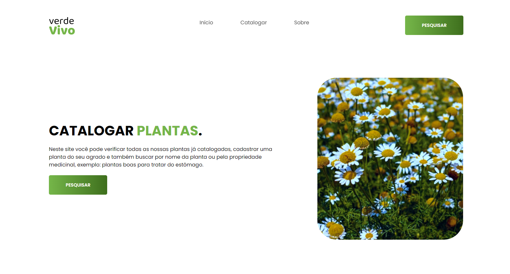

# API de Plantas - Arquivo JSON

##  Olá! Criei esta API para uma avaliação escolar utilizando BootStrap que contém algumas plantas e nela você pode: 
- Adicionar plantas; 
- Excluir plantas; 
- Pesquisar plantas por propriedade e por nome; 
- Editar dados de uma planta; 
- Verficar todos as plantas nesta API em formato de cards; 
- Você pode também testar a versão para mobile; 

## Linguagens que utilizei para fazer esta API:

